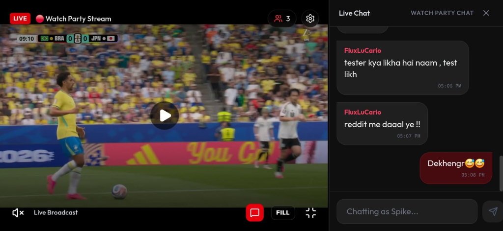
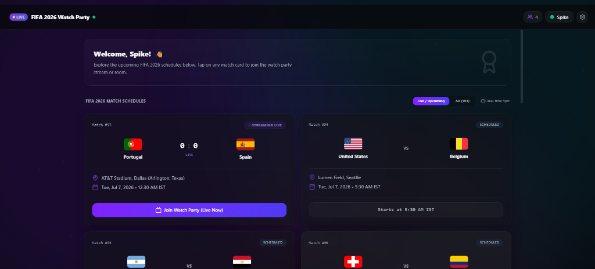
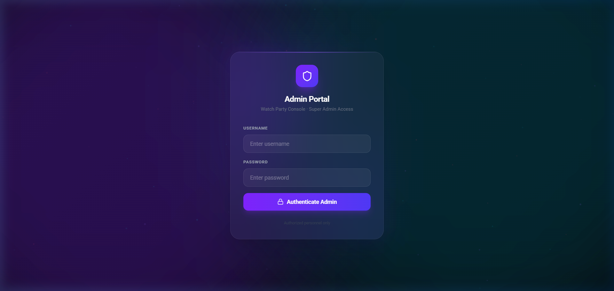
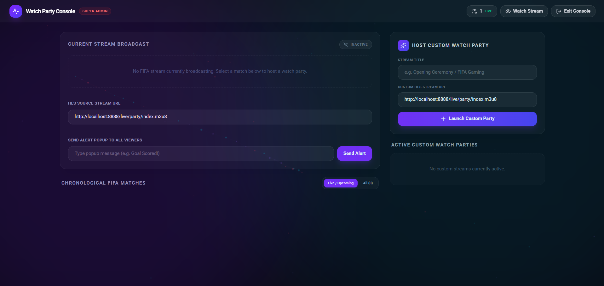
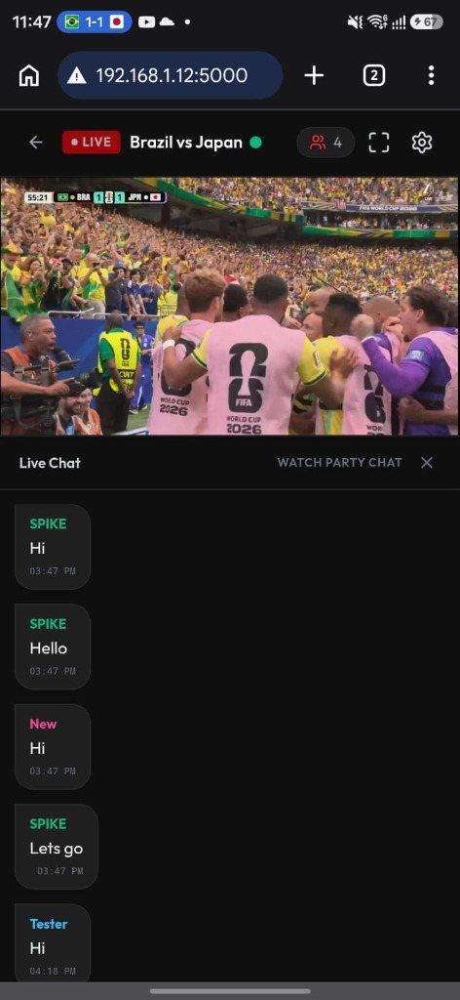
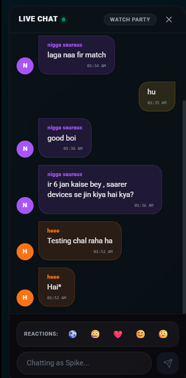
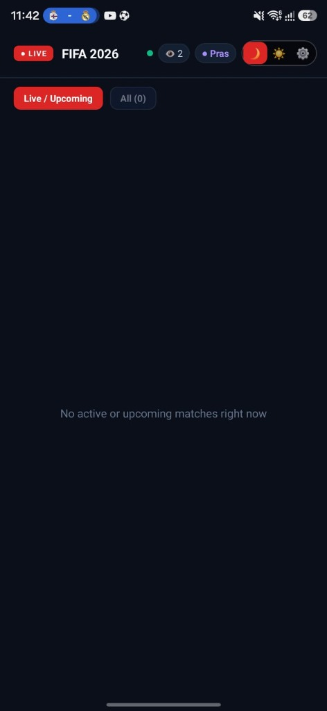

<div align="center">

# 🎥 WatchParty — Low-Latency Live Streaming & Watch Party Platform

[](https://reactjs.org/)
[](https://www.typescriptlang.org/)
[](https://vitejs.dev/)
[](https://socket.io/)
[](https://capacitorjs.com/)
[](LICENSE)

*Broadcast live video via OBS Studio to cloud or local media servers, with real-time chat, floating emoji reactions, custom HUD video controls, and mobile push alerts.*

</div>

---

## 📸 Screenshots Showcase

### 📺 Live Stream Player & Real-Time Watch Party (Desktop View)
<p align="center">
  
</p>

### ⚽ Match Schedules & Room Discovery
<p align="center">
  
</p>

### ⚡ Admin Control Panel & Stream Broadcast Manager
<table width="100%">
  <tr>
    <td width="50%" align="center">
      <b>1. Password-Protected Admin Login Portal</b><br/><br/>
      
    </td>
    <td width="50%" align="center">
      <b>2. Broadcast Controls & Live Stream Console</b><br/><br/>
      
    </td>
  </tr>
</table>

### 📱 Mobile Web & Native Android App Experience
<table width="100%">
  <tr>
    <td width="33%" align="center">
      <b>Mobile Stream View</b><br/><br/>
      
    </td>
    <td width="33%" align="center">
      <b>Real-Time Chat & Emojis</b><br/><br/>
      
    </td>
    <td width="33%" align="center">
      <b>Native Android App UI</b><br/><br/>
      
    </td>
  </tr>
</table>

---

## 📋 Table of Contents
1. [System Overview & Architecture](#-system-overview--architecture)
2. [Step 1: Prerequisites & Initial Project Setup](#step-1-prerequisites--initial-project-setup)
3. [Step 2: Firebase FCM & Android Configuration (Push Notifications)](#step-2-firebase-fcm--android-configuration-push-notifications)
4. [Step 3: Server Hosting Options (Oracle Cloud, AWS, GCP, or LAN-Only)](#step-3-server-hosting-options-oracle-cloud-aws-gcp-or-lan-only)
   - [Option A: Oracle Cloud Infrastructure (OCI Always Free — RECOMMENDED)](#option-a-oracle-cloud-infrastructure-oci-always-free--recommended)
   - [Option B: AWS EC2 / Google Cloud Platform (GCP)](#option-b-aws-ec2--google-cloud-platform-gcp)
   - [Option C: LAN-Only Setup (Local Home/Office Wi-Fi — FREE & NO CLOUD NEEDED)](#option-c-lan-only-setup-local-homeoffice-wi-fi--free--no-cloud-needed)
5. [Step 4: MediaMTX Installation & Buffer Optimization](#step-4-mediamtx-installation--buffer-optimization)
6. [Step 5: Setting Up OBS Studio for Broadcasting](#step-5-setting-up-obs-studio-for-broadcasting)
7. [Step 6: Environment Configuration & IP Pointing](#step-6-environment-configuration--ip-pointing)
8. [Step 7: Running Backend & Frontend Servers](#step-7-running-backend--frontend-servers)
9. [Step 8: Building the Android APK](#step-8-building-the-android-apk)
10. [⚽ FIFA Match System & How to Remove It](#-fifa-match-system--how-to-remove-it)

---

## 🏗️ System Overview & Architecture

To allow viewers from anywhere on the internet (or on your local network) to watch your stream and chat in real-time, the application relies on 4 main pieces working together:

```
┌─────────────────────────┐
│       OBS Studio        │  1. Streams video via RTMP
│  (Broadcaster / PC)     │  rtmp://<SERVER_IP>:1935/live/party
└───────────┬─────────────┘
            │
            ▼
┌─────────────────────────┐
│   MediaMTX Server       │  2. Converts RTMP stream to HLS (.m3u8)
│  (Cloud VPS or LAN PC)  │  http://<SERVER_IP>:8888/live/party/index.m3u8
└───────────┬─────────────┘
            │
            ▼
┌─────────────────────────┐
│ Node.js Express Server  │  3. Handles WebSocket Chat, Reactions, User List,
│  (port 5000)            │  and triggers Firebase FCM Push Notifications
└───────────┬─────────────┘
            │
            ▼
┌─────────────────────────┐
│ Viewers Web / Android   │  4. Plays HLS video in custom player HUD
│  (React & Capacitor)    │  and connects to Socket.IO chat
└─────────────────────────┘
```

---

## Step 1: Prerequisites & Initial Project Setup

Before starting, install the following software on your local machine:
- **Node.js** (v18.0.0 or higher) — [Download Here](https://nodejs.org/)
- **Git** — [Download Here](https://git-scm.com/)
- **OBS Studio** — [Download Here](https://obsproject.com/)
- **Android Studio** (Required ONLY if building the Android APK) — [Download Here](https://developer.android.com/studio)

### 1.1 Clone the Project Repository
Open your terminal (PowerShell or Command Prompt) and run:
```bash
git clone https://github.com/your-username/watchparty.git
cd watchparty
```

### 1.2 Install Project Dependencies
Run the following command to download all required packages:
```bash
npm install
```

---

## Step 2: Firebase FCM & Android Configuration (Push Notifications)

### What are these files and why do we need them?
1. **`firebase-service-account.json`**: This is a private key file used by your **Node.js backend server (`server.js`)**. It authorizes the server to communicate with Google's Firebase servers to send push notifications ("*⚽ Match is Live — Hop In!*") to all mobile app users.
2. **`google-services.json`**: This is a configuration file embedded inside the **Android mobile app (`android/app/`)**. It teaches the Android app how to register its device token with your Firebase project so it can receive those alerts.

---

### Step 2.1: Create a Firebase Project
1. Go to the [Firebase Console](https://console.firebase.google.com/).
2. Click **Create a project** (or **Add project**).
3. Enter a project name (e.g., `watchparty-app`) and click **Continue**.
4. Disable Google Analytics (optional, not required) and click **Create project**.
5. Wait for it to finish, then click **Continue**.

---

### Step 2.2: Generate `firebase-service-account.json` (Backend Key)
1. In your Firebase Console dashboard, click the ⚙️ **Gear icon** next to *Project Overview* in the top-left menu, and select **Project settings**.
2. Click on the **Service accounts** tab at the top.
3. Click the blue button labeled **Generate new private key**.
4. A warning modal will pop up; click **Generate key**.
5. A JSON file will download to your computer.
6. Rename this downloaded file to **`firebase-service-account.json`**.
7. Move/copy this file directly into the **root folder** of your project:
   ```text
   watchparty/
   ├── firebase-service-account.json   <-- PLACE IT HERE!
   ├── server.js
   ├── package.json
   ...
   ```

---

### Step 2.3: Generate `google-services.json` (Android App Config)
1. Go back to your Firebase Console → **Project Settings** → **General** tab.
2. Scroll down to the *Your apps* section and click the **Android icon (🤖)** to register an app.
3. In **Android package name**, type exact package name used by Capacitor:
   ```text
   com.watchparty.live
   ```
4. In **App nickname**, type `WatchParty Android`.
5. Click **Register app**.
6. Step 2 will present a button to **Download google-services.json**. Click it.
7. Move/copy this downloaded file into your project's **`android/app/`** directory:
   ```text
   watchparty/
   └── android/
       └── app/
           ├── google-services.json   <-- PLACE IT HERE!
           ├── build.gradle
           └── src/
   ```
8. Click **Next** through the remaining Firebase setup prompts and finish.

---

## Step 3: Server Hosting Options (Oracle Cloud, AWS, GCP, or LAN-Only)

Depending on your use case, choose one of the 3 setup options below:

---

### Option A: Oracle Cloud Infrastructure (OCI Always Free — RECOMMENDED ⭐)

Why Oracle Cloud?
Oracle Cloud provides an **Always Free Tier** with **up to 10 TB – 24 TB of outbound bandwidth per month for 0$**, plus up to 4 ARM Ampere CPU cores and 24 GB of RAM! This makes it by far the **best free option** for self-hosting high-bandwidth live streaming servers.

#### Step 1: Create Instance
1. Sign up for an account at [Oracle Cloud Free Tier](https://www.oracle.com/cloud/free/).
2. In the OCI Console, go to **Compute** → **Instances** → **Create Instance**.
3. **Image**: Ubuntu 22.04 or 24.04 Minimal.
4. **Shape**: Choose `VM.Standard.A1.Flex` (Ampere ARM, 2 to 4 cores, 8 to 24 GB RAM — Always Free Eligible!).
5. Download your SSH private key (`.key`).

#### Step 2: Open Ingress Security Rules in OCI VCN
1. Under your Instance Details, click on your **Virtual Cloud Network (VCN)** → **Security Lists** → **Default Security List**.
2. Click **Add Ingress Rules**:
   - **Source CIDR**: `0.0.0.0/0`
   - **IP Protocol**: TCP
   - **Destination Port Range**: `22, 1935, 8888, 9997, 5000, 80`
3. Click **Add Ingress Rules**.

#### Step 3: Open Ubuntu Linux Firewall (`iptables` / `ufw`) inside Oracle Instance
Oracle Ubuntu images block incoming ports by default. Connect via SSH and run these commands to unblock ports:
```bash
ssh -i "path/to/oracle-key.key" ubuntu@<YOUR_ORACLE_PUBLIC_IP>

# Open ports in iptables & save configuration
sudo iptables -I INPUT 6 -m state --state NEW -p tcp --dport 1935 -j ACCEPT
sudo iptables -I INPUT 6 -m state --state NEW -p tcp --dport 8888 -j ACCEPT
sudo iptables -I INPUT 6 -m state --state NEW -p tcp --dport 9997 -j ACCEPT
sudo iptables -I INPUT 6 -m state --state NEW -p tcp --dport 5000 -j ACCEPT
sudo apt install -y iptables-persistent
sudo netfilter-persistent save
```

---

### Option B: AWS EC2 / Google Cloud Platform (GCP)

If using **AWS EC2** or **GCP Compute Engine**:

#### AWS EC2:
1. Launch an Ubuntu 24.04 instance (`t2.micro` or `t3.medium`).
2. Under **Security Groups**, edit Inbound Rules:
   - Allow TCP Ports: `22` (SSH), `1935` (RTMP), `8888` (HLS), `9997` (Stats API), `5000` (Node Backend) from `0.0.0.0/0`.
3. Note your **Public IPv4 Address** (e.g. `54.210.85.120`).

#### Google Cloud Platform (GCP):
1. Go to **Compute Engine** → **VM Instances** → **Create Instance** (Ubuntu).
2. Go to **VPC Network** → **Firewall** → **Create Firewall Rule**:
   - Targets: All instances.
   - Source IPv4 ranges: `0.0.0.0/0`.
   - Specified protocols and ports: `tcp:1935,8888,9997,5000`.

---

### Option C: LAN-Only Setup (Local Home/Office Wi-Fi — FREE & NO CLOUD NEEDED)

If you only want to host a Watch Party for family, roommates, or friends connected to the **same home Wi-Fi network**, you **do not need any cloud VPS or server deployment!** Your local PC acts as both the Media Server and Backend.

#### Step 1: Find Your PC's Local IP Address
- **On Windows**: Open Command Prompt (`cmd`) and type:
  ```cmd
  ipconfig
  ```
  Look for **IPv4 Address** under your Wi-Fi or Ethernet adapter (e.g., `192.168.1.150`).

- **On Mac / Linux**: Open terminal and type:
  ```bash
  hostname -I
  ```
  *(Let's assume your local IP is `192.168.1.150`)*.

#### Step 2: Unblock Windows Firewall Ports (Windows Host)
If running on Windows, unblock inbound ports so phones/laptops on Wi-Fi can connect:
Open PowerShell as Administrator and run:
```powershell
New-NetFirewallRule -DisplayName "WatchParty LAN Ports" -Direction Inbound -LocalPort 1935,8888,9997,5000,5173 -Protocol TCP -Action Allow
```

#### Step 3: Local Environment Setup (`.env`)
In your `.env` file, use your local LAN IP (`192.168.1.150`):
```env
PORT=5000
MEDIAMTX_HLS_URL=http://192.168.1.150:8888/live/party/index.m3u8
MEDIAMTX_STATS_URL=http://192.168.1.150:9997/v3/paths/live/party

VITE_SOCKET_URL=http://192.168.1.150:5000
VITE_HLS_URL=http://192.168.1.150:8888/live/party/index.m3u8

ALLOWED_ORIGINS=http://localhost:5173,http://192.168.1.150:5173,http://192.168.1.150:5000
```
Devices on your Wi-Fi can now open `http://192.168.1.150:5173` on their phone/laptop browser to join!

---

## Step 4: MediaMTX Installation & Buffer Optimization

Follow these commands to install and configure **MediaMTX** on your server (Cloud VPS or Local Linux/Windows PC):

### Step 4.1: Download & Extract MediaMTX

#### On Linux Server (Oracle / AWS / GCP / Ubuntu):
```bash
# SSH into your server
ssh -i "path/to/key.pem" ubuntu@<YOUR_SERVER_IP>

# Update Linux package index & install tools
sudo apt update && sudo apt install -y wget tar nano

# Create directory
mkdir -p ~/mediamtx && cd ~/mediamtx

# Download latest MediaMTX release (for x86_64)
wget https://github.com/bluenviron/mediamtx/releases/download/v1.9.3/mediamtx_v1.9.3_linux_amd64.tar.gz

# Note: If using Oracle ARM Ampere server, download arm64 version instead:
# wget https://github.com/bluenviron/mediamtx/releases/download/v1.9.3/mediamtx_v1.9.3_linux_arm64v8.tar.gz

# Extract archive
tar -xzf mediamtx_v1.9.3_linux_*.tar.gz
```

#### On Windows Local PC:
1. Download `mediamtx_v1.9.3_windows_amd64.zip` from [MediaMTX Releases](https://github.com/bluenviron/mediamtx/releases).
2. Extract the zip file to a folder (e.g. `C:\mediamtx`).

---

### Step 4.2: MediaMTX Buffer & Smooth Playback Tuning

Default MediaMTX settings package video with zero buffer, causing stuttering on slow network connections. We will tune `mediamtx.yml` for smooth playback.

Open `mediamtx.yml` in an editor (`nano mediamtx.yml` on Linux):
```yaml
# Enable HLS server
hls: yes
hlsAddress: :8888
hlsAlwaysRemux: yes
hlsVariant: mpegts

# 🚀 BUFFER & SMOOTHNESS OPTIMIZATIONS:
# Set segment duration to 2 seconds for low latency with adequate buffering
hlsSegmentDuration: 2s

# Maintain a rolling window of 7 segments in manifest (~14 seconds buffer pool)
hlsSegmentCount: 7

# Keep maximum 15 segments on disk before cleanup
hlsMaxDemuxerDelay: 10s
```
Save and close the file.

---

### Step 4.3: Start MediaMTX in Background

#### On Linux Server:
```bash
sudo apt install -y screen
screen -dmS mediamtx ./mediamtx
```

#### On Windows Local PC:
Double-click `mediamtx.exe` to launch it.

---

## Step 5: Setting Up OBS Studio for Broadcasting

Now configure **OBS Studio** on your broadcasting PC to send video to MediaMTX.

### Step 5.1: Configure Stream Settings in OBS
1. Open **OBS Studio**.
2. Click **Settings** → **Stream** tab.
3. **Service**: `Custom...`
4. **Server**: `rtmp://<YOUR_SERVER_IP>:1935/live/`
   *(Replace `<YOUR_SERVER_IP>` with your Oracle Cloud Public IP, AWS IP, or local LAN IP like `192.168.1.150`)*
5. **Stream Key**: `party`
6. Click **Apply**.

---

### Step 5.2: Recommended OBS Encoding Settings for Smooth Playback
1. Go to **Settings** → **Output** tab → set Output Mode to **Advanced**.
2. **Encoder**: `NVIDIA NVENC H.264` (or `x264`).
3. **Rate Control**: `CBR`.
4. **Bitrate**: `3500 Kbps` to `5000 Kbps` (for 1080p60fps).
5. **Keyframe Interval**: `2 s` *(CRITICAL: Must match MediaMTX 2s segment duration!)*.
6. Click **OK**.

---

### Step 5.3: Test the Broadcast
Click **Start Streaming** in OBS Studio. Your HLS video stream will automatically become available at:
```text
http://<YOUR_SERVER_IP>:8888/live/party/index.m3u8
```

---

## Step 6: Environment Configuration & IP Pointing

Create a **`.env`** file in your local project root folder (`watchparty/`):

```env
# Server Port
PORT=5000

# Server URLs (Replace <YOUR_SERVER_IP> with Oracle Public IP, AWS IP, or LAN IP)
MEDIAMTX_HLS_URL=http://<YOUR_SERVER_IP>:8888/live/party/index.m3u8
MEDIAMTX_STATS_URL=http://<YOUR_SERVER_IP>:9997/v3/paths/live/party

# Client Environment Variables
VITE_SOCKET_URL=http://<YOUR_SERVER_IP>:5000
VITE_HLS_URL=http://<YOUR_SERVER_IP>:8888/live/party/index.m3u8

# Allowed Origins (CORS)
ALLOWED_ORIGINS=http://localhost:5173,http://localhost:4173,http://<YOUR_SERVER_IP>:5000,http://<YOUR_SERVER_IP>:5173
```

---

## Step 7: Running Backend & Frontend Servers

### 1. Start the Express Socket.IO Backend Server:
In project root, run:
```bash
node server.js
```

### 2. Start the Vite Frontend Development Server:
In a second terminal window, run:
```bash
npm run dev
```
Open your browser at `http://localhost:5173` (or `http://<YOUR_LAN_IP>:5173` for LAN viewers).

---

### 🔍 Stream URL Verification & In-App Manual Setup Guide

#### 1. What Kind of URLs can be pasted?
* ✅ **HLS Stream Playlist URLs (`.m3u8`)** — **REQUIRED**:
  - Example: `http://<YOUR_SERVER_IP>:8888/live/party/index.m3u8`
  - Example: `https://your-cdn-server.com/hls/live_stream.m3u8`
* ✅ **Direct Video Files (`.mp4`)** (for video watch parties).
* ❌ **DO NOT PASTE**: Raw website links (e.g. `https://youtube.com/watch?v=...` or `https://twitch.tv/...`). Standard HTML5 video players (`hls.js`) require a direct HLS manifest link ending in `.m3u8`.

---

#### 2. How to Verify your Stream URL before pasting (VLC Test)
Before sharing or launching your stream, test if your Media Server URL is live:
1. Open **VLC Media Player** on your computer.
2. Go to **Media** (top menu) → **Open Network Stream...** (or press `Ctrl + N`).
3. Paste your stream URL: `http://<YOUR_SERVER_IP>:8888/live/party/index.m3u8`.
4. Click **Play**. If video streams in VLC, your Media Server URL is 100% active and ready!

---

#### 3. Where to set or paste the URL in WatchParty

* **Method A — Automatic Pre-Loading (`.env` file)**:
  Set `VITE_HLS_URL` in your `.env` file before running `npm run dev`:
  ```env
  VITE_HLS_URL=http://<YOUR_SERVER_IP>:8888/live/party/index.m3u8
  ```
  Every user opening the site will automatically stream this URL without entering anything!

* **Method B — Live Broadcast Switching (Admin Control Panel)**:
  1. Open `http://localhost:5173/?admin=true` (or `http://<SERVER_IP>:5173/?admin=true`).
  2. Enter admin password (default: `watchparty2026`).
  3. Go to the **Custom Stream** tab.
  4. Enter a stream title and **paste your `.m3u8` URL**.
  5. Click **Launch Stream**. This will update and sync the live video stream for **all connected viewers** in real time!

* **Method C — Backend Server Verification (Settings Modal ⚙️)**:
  If viewers or mobile app users cannot connect to chat:
  1. Click the **⚙️ Settings Gear Icon** in the top header.
  2. Verify that **Chat Backend API URL** matches your server (e.g. `http://localhost:5000` or `http://192.168.1.150:5000`).
  3. Click **Save Settings**.

---

## Step 8: Building the Android APK

To build the native Android `.apk` package:

1. Build production web bundle:
   ```bash
   npm run build
   ```
2. Sync into Android folder:
   ```bash
   npx cap sync android
   ```
3. Open Android Studio:
   ```bash
   npx cap open android
   ```
4. In Android Studio:
   - Go to **Build** → **Build Bundle(s) / APK(s)** → **Build APK(s)**.
   - Once finished, click **locate** to grab your `app-debug.apk` file!

---

## ⚽ FIFA Match System & How to Remove It

This project includes an optional built-in **FIFA Match Engine** that handles live scoreboards, match clocks, player event logs (goals, yellow/red cards, VAR), and automatic match state synchronization across viewers.

### Using WatchParty for Movies, Anime, or General Gaming
If you are streaming movies or non-FIFA games, you **do not need to modify any code**:
1. Open the app and log into the Admin Dashboard (`http://localhost:5173/?admin=true`).
2. Enter admin password (default: `watchparty2026`).
3. Select **Custom Stream** tab.
4. Paste any HLS stream URL or title and click **Launch Stream**. The scoreboard will hide and standard video player HUD will take over.

### Completely Removing FIFA Code from the Project
If you want to permanently strip out all FIFA logic:

1. **Backend (`server.js`)**:
   * Delete `fifaMatches` array (around lines 200–300).
   * Delete `pollMatches()` function.
   * Delete socket handlers `admin_start_stream`, `admin_add_event`, and `admin_delete_event`.
2. **Frontend UI (`src/App.tsx`)**:
   * Remove `isLiveScoreOnlyMode` check and the `<MatchScoreboard />` overlay.
3. **Lobby (`src/components/LobbyView.tsx`)**:
   * Remove the "Matches" tab filter so only custom stream cards are displayed.

---

## ❓ Troubleshooting & FAQs

* **Q: Why use Oracle Cloud over AWS?**
  * Oracle Cloud offers an **Always Free Tier** with **up to 10 TB – 24 TB of free outbound bandwidth per month**, whereas AWS Free Tier charges for bandwidth after 100 GB.
* **Q: Can I run this completely offline or on local home Wi-Fi?**
  * Yes! Follow **Step 3 (Option C)** to set up a LAN-only watch party with zero cloud costs.
* **Q: The video says "Offline" or keeps loading forever?**
  * Verify OBS Studio is actively streaming to `rtmp://<SERVER_IP>:1935/live/` key `party`.
  * Ensure port `8888` and `1935` are allowed in your Cloud Firewall / Windows Firewall rules.

---

## 📄 License
MIT License. Built for seamless, low-latency live watch party experiences!
